# Cloud Provider Analytics, notas de diseño

Proyecto integrador de Big Data, ITBA, segundo cuatrimestre 2026.
Primera entrega: diseño y fundación de datos. Versión 1, 2026-10-03.

Grupo 11: Ivan Odzomek, Lucas Campoli, Matias Sapino, Diego Rabinovich, Diego Badin.

Este es el documento principal. El detalle de apoyo está en el apéndice al final de este documento.
En el repositorio quedan `DECISIONS.md`, con cada decisión y las alternativas que miramos, y
`evidence/landing_profile.md`, con los números medidos que produce
`notebooks/01_landing_exploration.ipynb`.

## 1. Problema, usuarios, preguntas y objetivos

Somos el equipo de datos de un proveedor de nube. Los datos de clientes llegan crudos y sucios:
nulos, números que a veces vienen como texto, costos negativos cada tanto, y un cambio de esquema a
mitad del histórico. Los eventos de uso aparecen como fragmentos JSONL chicos, no como un archivo
prolijo.

El trabajo es convertir esas fuentes en un conjunto chico de tablas que FinOps, Soporte y Producto
puedan consultar. Los maestros y la facturación pueden esperar un batch diario o mensual. El uso
tiene que estar más cerca del tiempo real.

### 1.1 Usuarios


| Quién            | Qué decide                                                   | Qué necesita de nosotros                                                                                                |
| ---------------- | ------------------------------------------------------------ | ----------------------------------------------------------------------------------------------------------------------- |
| FinOps           | A dónde se va el gasto, qué facturar, qué cargos investigar. | Costo y consumo diarios por organización y servicio, flags de anomalía, revenue en USD después de créditos e impuestos. |
| Soporte          | Dónde poner gente, qué cuentas están en riesgo.              | Volumen de tickets por severidad, tasa de incumplimiento de SLA y CSAT por organización y fecha.                        |
| Producto y Usage | En qué servicios invertir, cómo crece la adopción de GenAI.  | Requests y métricas operativas por servicio, tokens de GenAI y carbono cuando existen.                                  |


### 1.2 Preguntas y las consultas que las responden

Cada pregunta tiene que salir de Cassandra con la lectura de una sola partición. Las cinco consultas
son las que fija el §7.4 de la consigna.


| #   | Pregunta                                                                                | Dominio  |
| --- | --------------------------------------------------------------------------------------- | -------- |
| Q1  | ¿Cuánto gastó una organización por servicio, día por día, en un rango de fechas?        | FinOps   |
| Q2  | ¿Qué servicios le costaron más a una organización en los últimos 14 días?               | FinOps   |
| Q3  | ¿Cómo vienen los tickets críticos y los incumplimientos de SLA en 30 días?              | Soporte  |
| Q4  | ¿Cuál es el revenue mensual de una organización en USD después de créditos e impuestos? | FinOps   |
| Q5  | ¿Cuántos tokens de GenAI usó una organización por día, y a qué costo?                   | Producto |
| Q6  | ¿Qué días se ven raros? Es una pregunta nuestra de FinOps, fuera de las cinco.          | FinOps   |


### 1.3 Objetivos

Las bases de calidad son lo que miden los datos hoy, de modo que si una carga posterior empeora se
nota.


| #   | Objetivo                                                           | Umbral                          | Base de hoy           |
| --- | ------------------------------------------------------------------ | ------------------------------- | --------------------- |
| O1  | Los marts diarios del día D se publican temprano en D+1            | antes de las 06:00 UTC          | n/a                   |
| O2  | `event_id` presente y único en Silver                              | 100%, sin duplicados            | 0 nulos, 0 duplicados |
| O3  | Quarantine sigue siendo una excepción, contada en filas y en costo | 1% de los eventos, 1% del costo | 0% y 0%               |


O3 cuenta costo además de filas porque los dos pueden apuntar para lados distintos. Rechazar todo
evento con `unit` faltante tiraría menos del 5% de los eventos, y más o menos la misma proporción de
todo el costo, lo que subestimaría cada mart de FinOps. En §5.2 están las reglas que los conservan.

## 2. Por qué esto es un problema de Big Data

Velocidad, variedad y veracidad dominan el caso y son alrededor de qué está construida la
arquitectura. El volumen es la más débil de las cinco en los 13 MB que nos dieron, y lo
argumentamos por proyección.


| V         | Peso          | Evidencia medida                                                                                                                                                                                                                                                                     | Qué obliga                                                                                                                                                         |
| --------- | ------------- | ------------------------------------------------------------------------------------------------------------------------------------------------------------------------------------------------------------------------------------------------------------------------------------ | ------------------------------------------------------------------------------------------------------------------------------------------------------------------ |
| Velocidad | Dominante     | El uso llega como 120 partes JSONL pensadas para leerse como micro-batches. Reproducidas en orden, un watermark de 1 día trata al 97,5% de los eventos como tardíos, el de 7 días al 87,6% y el de 30 días al 49,6%.                                                                 | Structured Streaming para la ingesta, sin agregación por ventanas. Los marts diarios se recalculan en batch.                                                       |
| Variedad  | Dominante     | Dos formatos, 6 maestros CSV más la facturación y los eventos JSONL. Dos layouts de evento, 11 campos en v1 y 12 o 13 en v2. `value` llega como número JSON 41.014 veces y como string entre comillas 1.309 veces. `unit` falta en 2.075 eventos. La facturación viene en 3 monedas. | Un esquema explícito que cubre las dos versiones, `value` leído como string y casteado en Silver, servicios y regiones conformados, moneda convertida por factura. |
| Veracidad | Dominante     | 211 eventos por debajo de -0,01 USD. El p99 del costo es 16,69 contra un máximo de 317,43. `nps_score` va de -38 a 101. 877 eventos con `value` nulo, 240 tickets sin `resolved_at`, 462 de 800 usuarios con timestamps contradictorios.                                             | Reglas de calidad que primero imputan, con una zona Quarantine, anomalías por una medida relativa y no por un umbral fijo, NPS marcado en lugar de promediado.     |
| Volumen   | Secundaria    | 13 MB: 43.200 eventos de 299 B en 60 días, unos 720 por día.                                                                                                                                                                                                                         | Particionar por una sola columna de fecha, Parquet con Snappy, tamaños de archivo bajo control.                                                                    |
| Valor     | Lo que compra | Un solo pipeline alimenta 5 consultas obligatorias de 3 dominios desde los mismos datos conformados.                                                                                                                                                                                 | Silver compartida, marts por dominio en Gold, modelado query-first en Cassandra.                                                                                   |


### 2.1 El volumen por proyección

El dataset es un modelo a escala. Lo proyectamos para ver si la arquitectura está dimensionada
para lo real. Tomando 50.000 organizaciones, 200 recursos medidos por cada una y una muestra por
minuto, el mismo pipeline movería unos 43.200 millones de eventos por día (43,2 × 10⁹), alrededor de 500.000 por
segundo y 0,6 PB de Parquet al año. La aritmética y los cinco supuestos están en el apéndice A.

A esa escala un lake particionado sobre object storage, un motor distribuido y un wide-column store para serving son necesarios. 

## 3. Fuentes

Los archivos están en `data/landing/` y no los modificamos. `org_id` aparece en todos y esa es
la clave de join, y el nombre del archivo es lo que nos da trazabilidad una vez que la fila está en
Bronze.


| Fuente                        | Grano                                  | Cada cuánto             | Notas                                                                                                                                                    |
| ----------------------------- | -------------------------------------- | ----------------------- | -------------------------------------------------------------------------------------------------------------------------------------------------------- |
| `customers_orgs.csv`          | Una organización, `org_id`             | Snapshot                | Industria, región, plan, NPS. Algunos NPS vacíos o fuera de rango.                                                                                       |
| `users.csv`                   | Un usuario, `user_id`                  | Snapshot                | Rol y actividad. `last_login` muchas veces vacío, y los timestamps se contradicen entre sí.                                                              |
| `resources.csv`               | Un recurso, `resource_id`              | Snapshot                | Servicio, región, estado. `tags_json` a veces vacío, y viene entre comillas, por lo que necesita escape al leer.                                         |
| `support_tickets.csv`         | Un ticket, `ticket_id`                 | Cuando se abren tickets | Severidad, SLA, CSAT. Los tickets abiertos no tienen `resolved_at`, y CSAT falta seguido.                                                                |
| `marketing_touches.csv`       | Un contacto, `touch_id`                | Cuando corren campañas  | Canal, clic y conversión. Sin nulos.                                                                                                                     |
| `nps_surveys.csv`             | Una respuesta por organización y fecha | En el tiempo            | 92 respuestas repartidas en 60 organizaciones, por lo que no es una fila por organización. Es aparte de la columna de NPS del archivo de organizaciones. |
| `billing_monthly.csv`         | Una factura, `invoice_id`              | Mensual, acá tres meses | Créditos, impuestos, moneda. Algunos créditos vacíos, 13 subtotales negativos, tres monedas.                                                             |
| `usage_events_stream/*.jsonl` | Un evento, `event_id`                  | Micro-batches           | `value` a veces nulo o texto. Los costos pueden ser negativos. `schema_version=2` agrega `carbon_kg` y, para genai, `genai_tokens`.                      |


Los conteos de filas, las proporciones de nulos y los chequeos de claves duplicadas por fuente están
en `evidence/landing_profile.md`.

### 3.1 Riesgos en los datos


| Riesgo                          | Por qué importa                                                                                                                                                                                                                | Mitigación                                                                                          |
| ------------------------------- | ------------------------------------------------------------------------------------------------------------------------------------------------------------------------------------------------------------------------------ | --------------------------------------------------------------------------------------------------- |
| Cambio de esquema               | Los eventos mezclan v1 y v2. Un esquema estricto por versión fallaría o descartaría las filas más viejas.                                                                                                                      | El esquema de §3.2.                                                                                 |
| Tipos ambiguos                  | `value` llega como número, como texto o como nulo. Un cast duro convierte las filas malas en nulos sin avisar, y con el modo ANSI de Spark 4 directamente corta el job.                                                        | Leer `value` como string en Bronze, castear en Silver con `try_cast`, mandar la falla a Quarantine. |
| Importes que no cierran         | Los costos y los subtotales pueden ser negativos, y la facturación no es toda en USD. Cada factura en USD trae una tasa distinta de 1,0, que deforma el revenue por organización hasta un 12% mientras casi no mueve el total. | §5.2, y convertir con la tasa propia de cada factura.                                               |
| Nulos en hechos que necesitamos | Los tickets abiertos no tienen tiempo de resolución, CSAT y NPS faltan seguido, 2.075 eventos no tienen `unit`. Los promedios que lo ignoran se ven mejor de lo que son.                                                       | Imputar solo lo que otro campo ya determina, y si no, dejar el nulo.                                |
| Timestamps contradictorios      | Más de la mitad de `users` tiene un `last_login` o un `created_at` que no se puede reconciliar con el resto de la fila.                                                                                                        | Marcar las dos cosas, y dejar los timestamps de `users` como de baja confianza.                     |


### 3.2 Esquema de los eventos

Las dos versiones se leen con un único `StructType` explícito, nunca con inferencia. La inferencia
muestrea los archivos que le toquen: un micro-batch con solo eventos v1 produciría un esquema
más angosto que uno con v2 y el conjunto de columnas cambiaría entre corridas. Las tres formas, de
11, 12 y 13 campos, entran por el mismo esquema sin ningún registro corrupto, y Bronze agrega arriba
`ingest_ts`, `ingest_date` y `source_file`. La lista de campos y la declaración están en el
apéndice B.

## 4. Patrón arquitectónico


### 4.1 Híbrido estilo Lambda

Dos capas sobre los mismos eventos. Structured Streaming hace append a Bronze y mantiene una vista
intradía provisoria de costo y requests, que es lo que responde al requisito de near real-time del
§2.1 de la consigna. La capa batch recalcula todos los marts de Gold desde Silver y reemplaza los
números provisorios por los definitivos. Los maestros y la facturación son solo batch.

Lo decidió la medición de late data. Cada uno de los 120 archivos abarca 59 de los 60 días del
dataset, de manera que los archivos no son cortes ordenados por tiempo. Reproducidos en orden de nombre
como micro-batches:


| Watermark | Eventos tardíos | Proporción |
| --------- | --------------- | ---------- |
| 1 día     | 42.118          | 97,5%      |
| 7 días    | 37.831          | 87,6%      |
| 30 días   | 21.421          | 49,6%      |


Una agregación con ventanas en streaming cierra la ventana cuando el watermark la pasa, y sobre estos
datos eso tiraría casi toda la entrada. Al batch no le importa el orden de llegada: un evento
tardío cae en la partición del día al que pertenece y la corrida siguiente corrige el total.

### 4.2 Alternativas


| Opción                         | Qué implicaría                                                                              | Por qué la descartamos                                                                                                                                                                                                                                                                                 |
| ------------------------------ | ------------------------------------------------------------------------------------------- | ------------------------------------------------------------------------------------------------------------------------------------------------------------------------------------------------------------------------------------------------------------------------------------------------------ |
| Batch puro                     | Un job agendado lee todo el directorio JSONL y reconstruye todo.                            | Incumple el requisito de near real-time y la capacidad obligatoria de Structured Streaming. Las métricas de uso quedarían con horas de atraso.                                                                                                                                                         |
| Kappa puro                     | Un solo job de streaming como único camino, y cada mart como agregación con estado.         | La mitad de las fuentes no pertenece a un stream: los maestros son snapshots y la facturación es mensual. Y el Gold diario en streaming solo tiene opciones malas, porque un watermark de 1 día descarta casi todos los eventos, y el que no los descartaría es de unos 60 días de estado de ventanas. |
| Híbrido estilo Lambda, elegido | Streaming para la ingesta y la vista provisoria, batch para todos los marts y los maestros. | Cumple los dos requisitos de velocidad, y el job de streaming queda libre de ventanas.                                                                                                                                                                                                                 |


La objeción de siempre a Lambda es mantener la misma lógica dos veces, y acá aplica a costo y
requests, que se suman en las dos capas y pueden no coincidir. Solo esas dos están duplicadas, el
número provisorio se sirve marcado como tal, y en D+1 gana el valor del batch. Mantener alineadas las
dos definiciones sigue siendo trabajo manual, y por eso el speed layer no cubre más de dos medidas.

### 4.3 Qué corre dónde


| Camino                 | Fuentes                         | Trigger                          | Escribe                                                         | Con estado                                                                                            |
| ---------------------- | ------------------------------- | -------------------------------- | --------------------------------------------------------------- | ----------------------------------------------------------------------------------------------------- |
| Streaming, speed layer | `usage_events_stream/*.jsonl`   | micro-batch, 1 min               | eventos en Bronze, vista intradía provisoria                    | Sin ventanas. Solo el conjunto de claves de dedupe, acotado por un watermark sobre `ingest_ts` (§6.3) |
| Batch diario           | eventos y dimensiones de Silver | diario, después de las 00:00 UTC | marts diarios de Gold para Q1, Q2, Q3, Q5, Q6                   | n/a                                                                                                   |
| Batch de snapshot      | los 6 maestros CSV              | diario                           | dimensiones en Bronze y Silver                                  | n/a                                                                                                   |
| Batch mensual          | `billing_monthly.csv`           | mensual                          | facturación en Bronze y `revenue_by_org_month` en Gold, para Q4 | n/a                                                                                                   |


### 4.4 La vista intradía provisoria

Cada micro-batch agrega sus propias filas en `foreachBatch` y escribe costo y requests provisorios por
organización, servicio y fecha de evento en Cassandra. El `batchId` de Spark es parte de la clave, así
que reprocesar un batch sobreescribe su propia fila en lugar de sumar una segunda contribución, y la
consulta suma las filas por batch del día que se le pide. La vista nunca dice estar completa, de modo que
la late data no la rompe, y la corrida diaria la reemplaza por los números definitivos. La mecánica y
el costo de usar el `batchId` en la clave están en el apéndice C. Esto es solo diseño: la entrega 2
pide el mart diario y no un speed layer, así que queda para después de la entrega 2.

## 5. Data Lake

Cinco zonas. Una zona es un contrato sobre quién puede escribir, quién puede leer y qué tiene que ser
cierto antes de que los datos lleguen, no una carpeta.


| Zona       | Escribe y lee                                                                                                                    | Formato y partición                                                                           | Retención                                                   | Puerta de entrada                                                                                               |
| ---------- | -------------------------------------------------------------------------------------------------------------------------------- | --------------------------------------------------------------------------------------------- | ----------------------------------------------------------- | --------------------------------------------------------------------------------------------------------------- |
| Landing    | Escriben los sistemas de origen. Leen los jobs de ingesta y la exploración de solo lectura. Ningún mart ni analista la lee       | CSV y JSONL como llegan, un directorio por fuente, sin particionar                            | Histórico completo, lo único desde donde podemos reprocesar | El archivo está completo y su nombre no figura ya en el registro de ingestados                                  |
| Bronze     | Streaming escribe los eventos, batch escribe maestros y facturación, solo append. Leen los jobs de Silver                        | Parquet, Snappy. Eventos por `ingest_date`, facturación por `month`, maestros sin particionar | 90 días móviles sobre `ingest_date`                         | La fila parseó con el esquema declarado. Acá no hay reglas de negocio                                           |
| Silver     | Solo jobs batch, sobreescribiendo la partición. Leen los jobs de Gold y los notebooks                                            | Parquet, Snappy, por `event_date`. Dimensiones sin particionar                                | Histórico completo, así Gold siempre se puede reconstruir   | La fila pasa todas las reglas de rechazo de §5.2. Las reparaciones se marcan, no bloquean                       |
| Gold       | Escriben los jobs de agregación y después el cargador a Cassandra. Leen las cinco consultas y las herramientas de BI             | Parquet, Snappy, y después Cassandra. Por `usage_date`, o `month` para revenue                | 13 meses móviles                                            | La partición concilia con Silver dentro de 0,01 USD por organización y día                                      |
| Quarantine | Bronze escribe las fallas de parseo, Silver las violaciones de reglas. La leen los ingenieros como cola de revisión, ningún mart | Parquet, Snappy, por `quarantine_date`, con `rule_name` como columna                          | 180 días                                                    | Nada se promueve. Una fila vuelve a entrar solo si se arregla la regla o la fuente y se reprocesa desde Landing |


Lo que la tabla comprime son los controles, que es lo que más cambia de zona en zona.

- Landing no aplica ninguno. La calidad ahí se observa y se hace cumplir después, y hasta el notebook
de exploración la lee sin escribirla.
- Bronze chequea una sola cosa, que la fila parsee con el esquema de §3.2, y manda lo que no a
Quarantine con su texto crudo. El grano queda como lo tenía la fuente, sin filtrar y sin deduplicar.
- Silver corre todo el conjunto de reglas de §5.2: `try_cast` en los números, `unit` imputado desde
`metric` y marcado, un `value` nulo que se deja nulo, costos negativos marcados, `dropDuplicates`
sobre `event_id`, servicios y regiones conformados, y chequeos referenciales contra las dimensiones.
- Gold concilia cada partición contra Silver antes de publicarla, y además chequea que las claves de
partición no sean nulas y que el conteo de filas coincida con el grano que el mart declara.
- Quarantine es el control en sí, y lo que se mira es su tamaño, contra O3. Las dos bases están
en cero hoy, y por eso D10 planifica fixtures para poder ejercitar el camino.

Las rutas siguen `datalake/<zona>/<entidad>/<partición>=<valor>/`, como en
`datalake/silver/usage_events/event_date=2025-08-01/`. Las columnas técnicas son lo que permite
rastrear un número hasta el archivo del que salió.


| Zona       | Columnas que agrega                                                      |
| ---------- | ------------------------------------------------------------------------ |
| Bronze     | `ingest_ts`, `ingest_date`, `source_file`                                |
| Silver     | `processed_ts`, `unit_imputed`, `cost_anomaly_flag`, `dq_status`         |
| Gold       | `computed_ts`, `run_id`, y los flags de Silver que viajan hacia adelante |
| Quarantine | `rule_name`, `quarantined_ts`, `raw_record`                              |


### 5.1 Particionado y archivos chicos

Acá hay dos problemas distintos: cuántas columnas de partición, y cuál. Los eventos se particionan por
una sola columna de fecha, y agregar `service` y `region` parece atractivo porque las consultas
filtran por ahí, pero con este volumen sale al revés.


| Particionado               | Particiones | Filas cada una | Tamaño de archivo |
| -------------------------- | ----------- | -------------- | ----------------- |
| solo fecha, elegido        | 60          | 720            | ~30 KB            |
| fecha y `service`          | 360         | 120            | ~6 KB             |
| fecha, `service`, `region` | 2.520       | 17             | ~1 KB             |


Un sistema de archivos distribuido paga un costo fijo por archivo y Spark agenda al menos una tarea
por archivo. Con miles de archivos de 1 KB el job termina gastando el tiempo en leer metadata, y los
row groups de Parquet más chicos que un bloque dejan de rendir. `service` y `region` se quedan como
columnas, donde las estadísticas de row group dejan que el lector saltee bloques que no pueden
coincidir. Apuntamos a archivos de decenas a cientos de MB, con `coalesce` antes de escribir.

Cuál columna de fecha importa igual de mucho. Una escritura de streaming produce al menos un archivo
por micro-batch y partición tocada, y cada archivo de la fuente abarca casi 60 fechas de evento
distintas. Si Bronze se particiona por `event_date`, un único micro-batch termina escribiendo en casi
todas las particiones del calendario a la vez.


| Bronze particionada por | Archivos escritos | Filas por archivo |
| ----------------------- | ----------------- | ----------------- |
| `event_date`            | 7.180             | 6,0               |
| `ingest_date`, elegido  | 120               | 360               |


`coalesce` no lo arregla, porque el abanico se abre dentro de cada micro-batch y cada batch
legítimamente tiene todas esas fechas. Así que las zonas particionan distinto: Bronze por
`ingest_date`, que es cómo llegaron los datos, y Silver y Gold por `event_date`, que es lo que
significan. El job de batch ve un día entero de una vez y puede hacer coalesce de cada partición. Esa
es una segunda razón por la que el camino batch no es opcional, y es por qué la retención de Bronze se
cuenta sobre `ingest_date`: contada sobre `event_date`, una ventana de 90 días ya habría vencido todo
este dataset de 2025.

En la escala proyectada una sola partición `event_date` se vuelve demasiado grande, y el segundo nivel
ahí debería ser `hour` o un bucket por hash de `org_id`, no `service`, que está desbalanceado.

### 5.2 Reglas de calidad

La política es imputar primero: rechazamos una fila solo cuando se contradice y no vale nada sin el
campo roto. Un campo fuera de rango se anula y se marca, y un valor plausible solo se marca.


| Fuente              | Regla                                                                                                                                         | Filas | Acción                                                             |
| ------------------- | --------------------------------------------------------------------------------------------------------------------------------------------- | ----- | ------------------------------------------------------------------ |
| eventos             | `event_id` nulo, `metric` desconocido, `timestamp` imposible de parsear, `unit` contra `metric`, `value` que no castea, claves que no joinean | 0     | quarantine                                                         |
| eventos             | `unit` nulo con un `metric` conocido                                                                                                          | 2.075 | imputar `unit` desde `metric`, marcar `unit_imputed`               |
| eventos             | `value` nulo                                                                                                                                  | 877   | se queda, aporta null a las sumas de uso, el costo se cuenta igual |
| eventos             | `cost_usd_increment` por debajo de -0,01                                                                                                      | 211   | marcar `cost_anomaly_flag`                                         |
| `support_tickets`   | `resolved_at` anterior a `created_at`                                                                                                         | 0     | quarantine                                                         |
| `billing_monthly`   | `currency` USD con `exchange_rate_to_usd` distinto de 1,0                                                                                     | 160   | forzar 1,0, marcar `fx_overridden`                                 |
| `support_tickets`   | `csat` fuera de 1 a 5                                                                                                                         | 40    | anular el campo, marcar `csat_invalid`                             |
| `customers_orgs`    | `nps_score` fuera de -100 a 100                                                                                                               | 1     | anular el campo, marcar `nps_score_invalid`                        |
| `billing_monthly`   | `credits` nulo                                                                                                                                | 137   | tratarlo como crédito cero                                         |
| `billing_monthly`   | `subtotal` por debajo de 0                                                                                                                    | 13    | marcar, se queda en el revenue como ajuste real                    |
| `users`             | `last_login` anterior a `created_at`                                                                                                          | 232   | marcar                                                             |
| `users`             | `created_at` anterior al `signup_date` de la organización                                                                                     | 249   | marcar                                                             |
| `marketing_touches` | `converted` con `clicked` en false                                                                                                            | 96    | marcar                                                             |


Las dos bases de Quarantine están en cero: 0 de 43.200 eventos y 0 de 4.112 filas de maestros.

`metric` determina `unit` uno a uno en los datos, `requests` a `count`, `cpu_hours` a `hours` y
`storage_gb_hours` a `gb_hours`, sin ninguna contradicción. Eso es lo que hace que imputar un `unit`
faltante sea una derivación y no una adivinanza, y por qué un `unit` que no coincide con su `metric`
es otro caso: ahí dos campos se contradicen y nada dice a cuál creerle.

Las filas de `users` las conservamos. Cada regla se dispara en cerca de un tercio del archivo y más de
la mitad de las filas rompe al menos una, cuando un dataset generado de forma causal mostraría casi
ninguna. Los tres timestamps se sortearon de forma independiente entre sí y de la
organización. Nada dice a qué campo culpar, y rechazar tiraría la mayor parte de una dimensión cuyos
`user_id`, `org_id`, `role` y `active` están sanos. Las dos reglas se marcan y los timestamps quedan
como de baja confianza: ninguna métrica de antigüedad o de recencia se construye sobre ellos.

Dos supuestos de escala son nuestros y no de la consigna. Tomamos `csat` de 1 a 5, y las dos columnas
de NPS en la escala agregada de -100 a 100, porque `nps_surveys.nps_score` va de -16 a 68 y eso
descarta una escala de 0 a 10 por respondente. Si la cátedra tiene otras escalas en mente, cambian dos
reglas.

Los casts usan `try_cast`. Spark 4 viene con el modo ANSI SQL activado, y un cast común levanta  
excepción con una entrada mal formada en lugar de devolver null, lo que cortaría el job en lugar de  
mandar la fila a Quarantine.

## 6. Arquitectura v1


### 6.1 Diagrama



La fuente en Mermaid está en el apéndice E.

La ingesta aparece como etiquetas sobre las flechas y no como cajas propias, y la herramienta de cada
paso está en las tablas de flujo de más abajo, que es lo que mantiene la figura en una página legible.
Las flechas llenas llevan datos que pasaron su control; las punteadas son el camino de calidad, los
rechazos hacia Quarantine y la única vuelta, arreglar y reprocesar desde Landing. El camino de
streaming escribe dos veces, hace append a Bronze y actualiza la vista provisoria, mientras Silver y
Gold son solo batch.

La banda de capacidades transversales es una sola caja en la figura. Por capacidad significa:


| Capacidad      | Cómo se implementa                                                                                         |
| -------------- | ---------------------------------------------------------------------------------------------------------- |
| Gobierno       | Un escritor y una puerta por zona (§5), decisiones en `DECISIONS.md`                                       |
| Calidad        | Reglas por fuente con bases medidas (§5.2), Quarantine como salida de control                              |
| Metadatos      | Esquemas explícitos (§3.2), un diccionario por zona, convenciones de partición y nombres                   |
| Linaje         | `ingest_ts`, `ingest_date`, `source_file`, `run_id`, y los flags `unit_imputed` y `fx_overridden`          |
| Seguridad      | Credenciales fuera de git, mínimo privilegio por zona, sin secretos en los notebooks                       |
| Observabilidad | El batch diario contra O1, volumen de filas por partición, tamaño de Quarantine contra O3, logs de corrida |


### 6.2 Flujo batch


| #   | Paso                          | Herramienta                     | Entrada                                                     | Salida                                         | Configuración clave                                                                          |
| --- | ----------------------------- | ------------------------------- | ----------------------------------------------------------- | ---------------------------------------------- | -------------------------------------------------------------------------------------------- |
| 1   | Levantar archivos nuevos      | PySpark, registro de ingestados | listado de Landing                                          | lista de archivos                              | el registro va por nombre de archivo, así una re-ejecución saltea lo que ya leyó             |
| 2   | Cargar maestros y facturación | `spark.read.csv`                | 6 maestros CSV, y `billing_monthly.csv` en su batch mensual | dimensiones en Bronze, facturación por `month` | esquema explícito, `escape='"'` para `tags_json`                                             |
| 3   | Conformar y reparar           | PySpark                         | eventos y dimensiones de Bronze                             | `usage_events` en Silver                       | `try_cast`, imputar `unit`, `dropDuplicates("event_id")`, sobreescribir por `event_date`     |
| 4   | Derivar rechazos              | escritura PySpark               | filas que fallan una regla de rechazo                       | Quarantine                                     | `rule_name` como columna, nunca como partición                                               |
| 5   | Agregar los marts             | `groupBy().agg()`               | Silver                                                      | marts diarios y revenue mensual en Gold        | `coalesce` para el tamaño de archivo, `partitionBy("usage_date")`, tasa forzada a 1,0 en USD |
| 6   | Conciliar y publicar          | PySpark, conector de Cassandra  | Silver y Gold                                               | tablas de Cassandra                            | puerta en 0,01 USD por organización y día, después upsert por la clave del mart              |


### 6.3 Flujo streaming


| #   | Paso                         | Herramienta                                                                               | Entrada                      | Salida                                           | Configuración clave                                                                   |
| --- | ---------------------------- | ----------------------------------------------------------------------------------------- | ---------------------------- | ------------------------------------------------ | ------------------------------------------------------------------------------------- |
| 1   | Mirar el directorio          | `readStream.json`                                                                         | `usage_events_stream/`       | frame del micro-batch                            | esquema explícito, `maxFilesPerTrigger` para acotar el batch                          |
| 2   | Sellar el linaje             | PySpark                                                                                   | frame del micro-batch        | agrega `ingest_ts`, `ingest_date`, `source_file` | `input_file_name()`                                                                   |
| 3   | Separar fallas de parseo     | PySpark                                                                                   | frame del micro-batch        | filas limpias, filas corruptas                   | `columnNameOfCorruptRecord`. Va antes del dedupe, por lo que sigue                    |
| 4   | Sacar repeticiones en vuelo  | `withWatermark("ingest_ts", ...)` y después `dropDuplicatesWithinWatermark(["event_id"])` | solo las filas limpias       | frame deduplicado                                | watermark sobre `ingest_ts`, nunca sobre `timestamp`                                  |
| 5   | Append a Bronze              | `writeStream`, Parquet                                                                    | filas limpias y deduplicadas | Bronze por `ingest_date`                         | un archivo por micro-batch, `checkpointLocation`                                      |
| 6   | Append de los rechazos       | `writeStream`, Parquet                                                                    | filas corruptas              | Quarantine                                       | checkpoint propio, para que un camino no bloquee al otro                              |
| 7   | Actualizar la vista intradía | `foreachBatch`, writer de Cassandra                                                       | filas limpias y deduplicadas | costo y requests provisorios                     | una fila por batch id, de modo que un reproceso sobreescribe en lugar de contar doble |


El trigger es `processingTime="1 minute"`. Ningún paso guarda una ventana, y el único estado es el
conjunto de claves de dedupe.

El orden de los pasos 3 y 4 no es intercambiable. Una fila que no parsea llega con `event_id` nulo, y
`dropDuplicates` agrupa los nulos entre sí como si fueran el mismo valor, igual que un `GROUP BY`. Si
el dedupe corriera primero, de todas las filas corruptas de un micro-batch sobreviviría una sola y el
resto desaparecería sin dejar rastro en Quarantine. Separar primero y deduplicar después deja el
dedupe trabajando sobre filas que tienen clave.

La columna del watermark necesitó atención. Las dos APIs de dedupe tiran los datos que quedan más
allá del watermark: PySpark documenta que `dropDuplicates` descarta "data older than watermark to
avoid any possibility of duplicates", y que `dropDuplicatesWithinWatermark`, agregada en Spark 3.5,
descarta "too late data older than watermark". Un watermark sobre el tiempo del evento borraría
entonces los eventos tardíos de Bronze, cuyo trabajo es ser una copia fiel.


| Columna del watermark   | Conserva todos los eventos                                                             | Estado de dedupe                                                     | Veredicto                      |
| ----------------------- | -------------------------------------------------------------------------------------- | -------------------------------------------------------------------- | ------------------------------ |
| `ingest_ts`, 1 hora     | Sí. Se sella en el momento de la lectura y nunca queda atrasada respecto de la llegada | Una hora de `event_id`                                               | Elegida                        |
| `timestamp`, 60 días    | Sí, el umbral supera el rango de los datos                                             | 60 días de claves, trivial hoy, 2,6 billones (2,6 × 10¹²) proyectado | Descartada por costo de estado |
| `timestamp`, 1 a 7 días | No, pierde casi todos los eventos                                                      | Chico                                                                | Descartada, rompe Bronze       |


Así el watermark acota cuánto tiempo se recuerda un duplicado en tiempo de llegada, que es el
horizonte en el que vive un reintento. La deduplicación exacta pasa igual más adelante: la
reconstrucción batch deduplica una partición `event_date` entera desde Bronze sin ningún watermark.

### 6.4 Matriz requisito-componente

Los requisitos son las dos capacidades del §2.1 de la consigna y las obligatorias del §4.4. La
columna V nombra la que empuja el requisito.


| Requisito                                                                                            | V                   | Componente                                                  | Decisión          |
| ---------------------------------------------------------------------------------------------------- | ------------------- | ----------------------------------------------------------- | ----------------- |
| Métricas de uso, consumo y costo incremental en near real-time                                       | Velocidad           | `foreachBatch` de streaming, vista intradía provisoria      | D3                |
| Ingesta batch a Bronze Parquet particionado, con esquemas explícitos                                 | Variedad            | Cargador batch, Bronze                                      | D1, D4, D5        |
| Ingesta streaming: esquema, watermark, dedupe, late data, checkpointing                              | Velocidad           | Structured Streaming, Bronze                                | D1, D3, D5        |
| Calidad: reglas verificables, filas inválidas separadas, quarantine en Parquet                       | Veracidad           | Conformar y reparar, Quarantine                             | D6, D7, D10       |
| Silver: normalizar, conformar, joinear dimensiones, tratar nulos y outliers, v1 y v2                 | Variedad, Veracidad | Conformar y reparar, Silver                                 | D1, D2, D6        |
| Features: `daily_cost_usd`, `requests`, `cpu_hours`, `storage_gb_hours`, `genai_tokens`, `carbon_kg` | Valor               | Agregación, Gold                                            | D6, §7            |
| Anomalías con un método justificado                                                                  | Veracidad           | Agregación, `cost_anomaly_mart`                             | D12, abierta      |
| Marts de Gold para FinOps, Soporte y Producto con granos claros                                      | Valor               | Gold                                                        | D4, §1.2          |
| Serving: keyspace de Cassandra, tablas query-first, carga desde Spark                                | Valor               | Cassandra, paso de publicación                              | D11 abierta, §1.2 |
| Idempotencia: reprocesar sin duplicados                                                              | Veracidad           | Sobreescritura de partición, upsert, registro de ingestados | D8                |
| Performance: particionado, control de archivos, coalesce, evidencia de tamaños                       | Volumen             | Layout de Bronze, Silver y Gold                             | D5                |
| Gobierno: calidad, metadatos, linaje, responsabilidades, seguridad, observabilidad                   | todas               | Banda transversal, §6.1                                     | D4, D6, D8        |
| Documentación: diagrama, diccionario, decisiones, quickstart, evidencias                             | todas               | `docs/`, `DECISIONS.md`, `evidence/`, `README.md`           | este documento    |


D11 y D12 están abiertas a propósito y las dos vencen en la entrega 2.

## 7. El flujo batch expresado como MapReduce

La consigna pide el procesamiento batch expresado como MapReduce, y no lo vamos a implementar en
Hadoop. Escribirlo es cómo razonamos por dónde se mueven los datos, y nos da algo contra lo que
comparar el job de Spark.

El flujo calcula `org_daily_usage_by_service`, que responde Q1 y Q2 y es el mart obligatorio de la
entrega 2, con una fila por organización, día y servicio. La entrada es Silver: la
conformación, el cast, la imputación, el dedupe y la separación a Quarantine ya pasaron y el mapper
puede dar por sentado un registro limpio por evento. Los splits, el dimensionamiento y la variante
que arranca de Bronze están en el apéndice D.

### 7.1 El job

```text
Silver, Parquet por event_date    se leen solo las fechas pedidas
  [ split 1 ] [ split 2 ] ...     un split por bloque, una tarea de map cada uno
        |           |
       MAP          emite (org_id, usage_date, service) -> (suma, conteo) por medida
       COMBINE      suma local, por tarea de map
       PARTITION    hash(org_id, usage_date, service) % R
        +--- SHUFFLE y SORT por clave ---+
        |           |
  [ REDUCE 1 ] ... [ REDUCE R ]   las claves llegan ordenadas, cada una una vez
        |           |
  Gold org_daily_usage_by_service, particionado por usage_date
```

El mismo job como pseudocódigo. La clave es el grano del mart y cada medida viaja como un par, una
suma y un conteo de valores presentes, para que una medición nula no pueda convertirse en un cero.

```text
key   = (org_id, usage_date, service)
value = un par (suma, conteo) por medida

map(record):
    slot = la medida que nombra record.metric      # requests | cpu_hours | storage_gb_hours
    emit(key(record), {
        cost:   (record.cost_usd_increment, 1 si está presente, si no 0),
        slot:   (record.value,              1 si record.value no es null, si no 0),
        genai:  (record.genai_tokens,       1 si está presente, si no 0),
        carbon: (record.carbon_kg,          1 si está presente, si no 0),
        events: 1,
        negative_cost: 1 si cost < -0.01, si no 0,
        unit_imputed:  1 si record.unit_imputed, si no 0 })

combine(key, values) = suma_elemento_a_elemento(values)    # la misma función que reduce

reduce(key, values):
    a = suma_elemento_a_elemento(values)
    emit(key, { por medida: a.m.suma si a.m.conteo > 0, si no null,
                events, negative_cost_events, unit_imputed_events })
```

El apéndice D tiene la versión con todos los campos escritos.

### 7.2 Map

Un evento produce exactamente un par clave-valor. El mapper no filtra nada, y del lado del
reduce se puede informar sobre cuántos eventos se apoya un número.

### 7.3 Combiner y partitioner

Todos los campos del valor son una suma o un conteo, de modo que el combiner es la misma función que
el reducer: `combine(key, values)` emite la suma elemento a elemento. Eso funciona solo porque la suma y
el conteo son asociativos y conmutativos. Un promedio no lo es, y por eso el reducer lo deriva de una
suma y un conteo, y un conteo de distintos no se podría combinar en absoluto.

```text
partition(key, R) = hash(org_id, usage_date, service) % R
```

El hash cubre toda la clave compuesta. Hashear solo por `org_id` mandaría todos los días y servicios
de una organización al mismo reducer, y como los tamaños de las organizaciones son desparejos unos
pocos tenants grandes decidirían cuánto tarda el job. El costo es que las filas de una organización
se reparten entre reducers y un top-N por organización no se puede calcular en la misma pasada.
Q2 no lo necesita, porque es un escaneo por rango dentro de una sola partición de Cassandra que se
ordena en el momento de leer, sobre 84 filas como máximo.

### 7.4 Reduce

Las claves llegan ordenadas, y un reducer recorre los días de una organización de forma
contigua, lo que le viene bien a la escritura en Cassandra porque la tabla de serving también tiene a
la organización como partition key y la fecha como clustering column.

El reducer suma los pares y después decide, por medida, si había algo que informar: un conteo en cero
pasa a null y no a 0. Un día sin `requests` usables informa null,
de modo que un promedio sobre el mart no queda arrastrado por días que nunca se midieron.

La salida es un registro por clave en
`datalake/gold/org_daily_usage_by_service/usage_date=.../`. La cantidad de archivos es igual a la
cantidad de reducers, por lo que R se elige por tamaño de archivo y no solo por paralelismo, la misma
preocupación de §5.1, y la escritura sobreescribe las particiones que calculó.

### 7.5 Costos negativos y las dos versiones de esquema

Estos son los dos lugares donde una implementación obvia se equivoca.


| Caso                                                     | Lo que se haría de forma obvia                                                  | Lo que hace este flujo                                                                                                                                                                                                            |
| -------------------------------------------------------- | ------------------------------------------------------------------------------- | --------------------------------------------------------------------------------------------------------------------------------------------------------------------------------------------------------------------------------- |
| 211 eventos con `cost_usd_increment` por debajo de -0,01 | Filtrarlos, o llevarlos a 0, para no tener un total negativo                    | Dejarlos en la suma, porque un incremento negativo es una corrección real y descartarlo infla el gasto. Contarlos en `negative_cost_events` para que quien revise vea que el día se apoya en correcciones                         |
| 10.800 eventos v1 sin `carbon_kg` ni `genai_tokens`      | Ramificar por `schema_version`, o saltear v1, o llevar los campos faltantes a 0 | Nada. El esquema único le da los 13 campos a todos los registros, y el par suma y conteo hace que un nulo no aporte a ninguno de los dos. Un día de solo v1 emite null en las dos medidas, y uno mezclado emite el subtotal de v2 |


Ninguna etapa lee `schema_version` para decidir algo, y eso es lo que queremos conservar cuando
aparezca una v3: se agrega el campo al esquema y a la tupla de valores, y ninguna lógica de etapa
cambia.

### 7.6 Cómo corre Spark lo mismo


| Etapa de MapReduce | Equivalente en Spark                                                                               |
| ------------------ | -------------------------------------------------------------------------------------------------- |
| Input splits       | Particiones del scan de Parquet, con la misma poda por `event_date`                                |
| Map                | Una proyección fusionada en el scan, no una etapa aparte                                           |
| Combiner           | Agregación parcial del lado del map, que elige Catalyst, normalmente un hash aggregate             |
| Partitioner        | `HashPartitioner` sobre las columnas de agrupamiento, aplicado en la escritura del shuffle         |
| Shuffle y sort     | Un exchange. Spark hace hash aggregate por defecto y ordena solo cuando tiene que derramar a disco |
| Reduce             | La agregación final del lado de la lectura del shuffle                                             |
| Output             | `write.partitionBy("usage_date")` después de un `coalesce` para dimensionar los archivos           |


Con la API de DataFrames el job es un solo `groupBy().agg()`, que está en el apéndice D junto con las
diferencias que importan. El `sum` de Spark ya ignora los nulos y devuelve null cuando todas las
entradas son nulas, con lo cual hace gratis lo que el par suma y conteo hace a mano. Catalyst elige la
estrategia de agregación, de modo que no hay combiner que escribir ni partitioner que elegir. Escribir
igual la versión MapReduce es lo que deja a la vista el shuffle, la elección de la clave y el riesgo de
desbalanceo, y esas cosas siguen decidiendo si el job de Spark rinde.

## 8. Plan


### 8.1 Supuestos

Los riesgos de los datos están en §3.1. Estos son los supuestos sobre los que se apoya el diseño.


| Supuesto                                                                                                 | Si está mal                                                                                                                                                                                               |
| -------------------------------------------------------------------------------------------------------- | --------------------------------------------------------------------------------------------------------------------------------------------------------------------------------------------------------- |
| `csat` es una escala de 1 a 5, y las dos columnas de NPS son la escala agregada de -100 a 100            | Cambian los umbrales de dos reglas de §5.2, y nada más se mueve                                                                                                                                           |
| Q3, Q4 y Q5 se piden por organización, como Q1 y Q2                                                      | El §7.4 de la consigna no lo dice para esas tres, y Q3 en particular puede ser global. Si alguna es global, no entra por una partición `(org_id)` y necesita su tabla propia particionada por fecha (D11) |
| `metric` determina `unit` uno a uno, como medimos                                                        | La imputación de `unit` deja de ser una derivación. La regla pasa a ser un chequeo de contradicción y esos 2.075 eventos van a Quarantine                                                                 |
| Una factura en USD debería traer una tasa de 1,0                                                         | La corrección de D9 está mal y el revenue por organización se mueve hasta un 12%                                                                                                                          |
| Un `credits` nulo significa sin crédito, no un monto desconocido                                         | El revenue queda inflado en 137 facturas                                                                                                                                                                  |
| Los archivos de Landing llegan completos, nunca a medio escribir                                         | El registro de ingestados puede promover un archivo truncado, y la promoción necesita un chequeo de tamaño o una marca                                                                                    |
| Un evento trae una sola medición de una métrica                                                          | El paso de map necesita más de un slot de valor por registro                                                                                                                                              |
| La muestra de 60 días es representativa de un sistema más grande                                         | La proyección de §2.1 está mal, y cambia el consejo de particionado que depende de ella                                                                                                                   |
| El dataset no cambia entre entregas                                                                      | Hay que regenerar todas las bases de `evidence/` y revisar los umbrales de §1.3                                                                                                                           |
| El tooling que planeamos alcanza: Colab o equivalente para Spark, un tier gratis de AstraDB para serving | Pasamos a Spark local y a un contenedor de Cassandra. Ninguna de las dos cosas cambia el diseño                                                                                                           |


### 8.2 Riesgos del proyecto


| Riesgo                                                                                | Impacto                                                                  | Mitigación                                                                           |
| ------------------------------------------------------------------------------------- | ------------------------------------------------------------------------ | ------------------------------------------------------------------------------------ |
| El setup de AstraDB traba el serving tarde en la entrega 2                            | Fallan dos ítems del checklist, el keyspace y las consultas              | Hacer el spike en la semana 1 contra una tabla vacía                                 |
| El estado del checkpoint queda inservible después de un cambio de esquema o de código | El job no arranca y la demo se cuelga                                    | Documentar un reset, y mantener Bronze reconstruible así resetear no cuesta nada     |
| Cinco personas editando un mismo documento de diseño                                  | Conflictos de merge y ediciones perdidas                                 | Un dueño por sección, ramas cortas, sin ediciones en paralelo sobre la misma sección |
| El speed layer se construye antes que el mart obligatorio                             | La entrega 2 se queda sin `org_daily_usage_by_service` por algo opcional | La vista provisoria queda para después de la entrega 2                               |
| Experiencia desigual con Spark en el equipo                                           | El trabajo se concentra en una o dos personas                            | Hacer de a dos el primer job de cada área, y usar el notebook como referencia común  |
| El feedback de la entrega 1 llega tarde y es sustancial                               | El rework compite con la implementación nueva                            | Las correcciones son el primer workstream de §8.4, no el último                      |


### 8.3 Decisiones abiertas


| Decisión                             | Qué está abierto                                                                                                                                                                                                 | Se decide antes de                                                                                |
| ------------------------------------ | ---------------------------------------------------------------------------------------------------------------------------------------------------------------------------------------------------------------- | ------------------------------------------------------------------------------------------------- |
| D11, modelo query-first en Cassandra | Si `(org_id)` sola acota el crecimiento de la partición o si hace falta un bucket por mes, el orden de clustering para Q2, si el mart de anomalías es tabla propia, y si Q3 a Q5 son por organización o globales | Escribir el keyspace en la entrega 2, que lo necesita                                             |
| D12, método y umbral de anomalías    | z-score, MAD o percentiles, con qué grano, sobre qué ventana, con qué corte                                                                                                                                      | `cost_anomaly_mart` en la entrega 2. Necesita la serie diaria agregada, no los incrementos crudos |


### 8.4 Roles y esfuerzo

Cinco roles, uno por persona, que el equipo se reparte. Cada rol es dueño del código, la evidencia y
la sección de este documento de su área.


| Rol              | De qué es dueño                                                                           |
| ---------------- | ----------------------------------------------------------------------------------------- |
| Ingesta          | Cargadores batch, el job de streaming, Bronze, los checkpoints, el registro de ingestados |
| Calidad y Silver | Las reglas de §5.2, Quarantine, la conformación, los joins con dimensiones                |
| Marts            | Las agregaciones de Gold, las features, el componente de anomalías                        |
| Serving          | Keyspace, tablas query-first, la carga de Spark a Cassandra, las consultas CQL            |
| Docs y release   | Este documento, el diagrama, `DECISIONS.md`, `evidence/`, los tags, el quickstart         |


Estimación contra el checklist de la entrega 2, en horas-persona.


| #   | Workstream                                                                   | Rol              | Horas | Depende de  |
| --- | ---------------------------------------------------------------------------- | ---------------- | ----- | ----------- |
| 1   | Correcciones del feedback de la entrega 1                                    | todos            | 10    | el feedback |
| 2   | Batch a Bronze, tres maestros                                                | Ingesta          | 10    |             |
| 3   | Streaming a Bronze, con watermark, dedupe y checkpointing                    | Ingesta          | 16    | 2           |
| 4   | Reglas de calidad, Quarantine y las muestras de los fixtures                 | Calidad y Silver | 14    | 3           |
| 5   | Silver para eventos y un maestro, joins, tres features                       | Calidad y Silver | 18    | 4           |
| 6   | `org_daily_usage_by_service` en Gold                                         | Marts            | 10    | 5           |
| 7   | Serving: keyspace, tabla, cargador, dos consultas CQL                        | Serving          | 16    | 6, D11      |
| 8   | Componente de analítica o ML                                                 | Marts            | 12    | 5           |
| 9   | Evidencia de idempotencia, conteos antes y después                           | Ingesta          | 6     | 3, 6        |
| 10  | Gobierno preliminar: controles, metadatos, linaje, accesos                   | Docs y release   | 8     |             |
| 11  | Quickstart, logs, evidencias de corrida, diagrama actualizado, backlog final | Docs y release   | 14    | todos       |
|     | Total                                                                        |                  | 134   |             |


134 horas en las seis semanas hasta el 2026-11-16, entre cinco personas, son unas cuatro horas y media  
por semana cada uno. El workstream 7 es el que tiene la única dependencia externa, y por eso el spike  
de AstraDB va en la semana 1.

Recursos: Colab o Spark local para los jobs, el free tier de AstraDB o un contenedor de Cassandra
para serving, y GitHub para el repo y la entrega.

