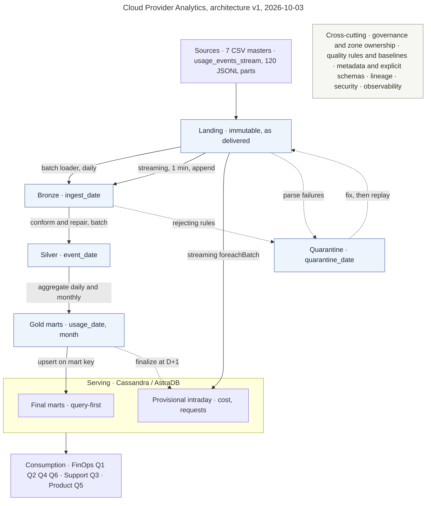

# Cloud Provider Analytics — Design notes

Group 11, first partial. Problem framing, the 5V case, a profile of the sources, the architectural pattern and the Data Lake design. Version 1, 2026-10-03.

## 1. Problem, users, questions and objectives

We act as the data team of a cloud provider. Customer data arrives raw and messy: nulls, numbers
that sometimes come as text, occasional negative costs, and a schema change mid-history. Usage
events show up as small JSONL fragments, not as one clean file.

The job is to turn those sources into a small set of tables FinOps, Support and Product can query.
Masters and billing can wait for a daily or monthly batch. Usage needs to be closer to real time.

### 1.1 Users

| Who | What they decide | What they need |
| :--- | :--- | :--- |
| FinOps | Where spend is going, what to invoice, which charges to investigate. | Daily cost and consumption by org and service, anomaly flags, revenue in USD after credits and taxes. |
| Support | Where to staff, which accounts are at risk. | Ticket volume by severity, SLA breach rate and CSAT by org and date. |
| Product / Usage | Which services to invest in, how GenAI adoption grows. | Requests and operational metrics by service, GenAI tokens and carbon where present. |

### 1.2 Questions and the queries that answer them

Each question has to be answerable from Cassandra with a single partition read. The five queries
are the ones fixed in §7.4 of the brief.

| # | Question | Domain | Gold mart | Partition key, clustering |
| :-- | :--- | :--- | :--- | :--- |
| Q1 | What did an org spend per service, day by day, over a date range? | FinOps | `org_daily_usage_by_service` | `(org_id)`, `usage_date, service` |
| Q2 | Which services cost an org most over the last 14 days? | FinOps | same mart, range-scanned then ranked | `(org_id)`, `usage_date, service` |
| Q3 | How are critical tickets and SLA breaches trending over 30 days? | Support | `tickets_by_org_date` | `(org_id)`, `ticket_date, severity` |
| Q4 | What is an org's monthly revenue in USD after credits and taxes? | FinOps | `revenue_by_org_month` | `(org_id)`, `month` |
| Q5 | How many GenAI tokens did an org use per day, at what cost? | Product | `genai_tokens_by_org_date` | `(org_id)`, `usage_date` |
| Q6 | Which days look abnormal? Additional FinOps question, outside the five. | FinOps | `cost_anomaly_mart` | `(org_id)`, `usage_date, service` |

Q1 and Q2 share one mart. Both are a date-range scan inside one org partition, so a second table
would duplicate the data for no gain. Q2 ranks the scan result, at most 14 days by 6 services.

### 1.3 Objectives

These are the success criteria. Quality baselines come from `evidence/landing_profile.md`, so a
regression is visible.

| # | Objective | Threshold | Baseline today |
| :-- | :--- | :--- | :--- |
| O1 | An event is queryable in Bronze soon after its file lands | 5 min, p95 | n/a |
| O2 | Daily marts for day D are published early on D+1 | by 06:00 UTC | n/a |
| O3 | The five queries answer fast enough for a dashboard | p95 under 1 s | n/a |
| O4 | `event_id` present and unique in Silver | 100%, no duplicates | 0 null, 0 duplicate |
| O5 | Quarantine stays an exception, measured in rows and in cost | 1% of events, 1% of cost | 0% and 0% |
| O6 | Every repair is flagged, never silent | 100% flagged | 2,075 `unit_imputed`, 160 `fx_overridden` |
| O7 | A missing `value` stays null, never becomes zero | usage sums skip it, cost still counted | 877 events, 2.01% of cost |
| O8 | Every row traceable to its source file, and joinable | 100% carry `ingest_ts` and `source_file` | 80 of 80 orgs, 400 of 400 resources resolve |
| O9 | Gold reconciles with Silver, and re-runs do not duplicate | 0.01 USD per org-day, row counts stable | n/a |

O5 is the objective that changed once we measured cost next to row counts. Quarantining every event
with a missing `unit` would have rejected 4.80% of events carrying 4.92% of all cost, understating
every FinOps mart by about 5%. Those rows are repaired instead, which is what brings the baseline to
zero. §5.7 has the rules.

## 2. Why this is a Big Data problem (5V)

Velocity, variety and veracity dominate this case and are what the architecture is built around.
Volume is the weakest V in the data we were given, 13 MB, so it is argued by projection. Figures
come from `notebooks/01_landing_exploration.ipynb`.

| V | Weight | Measured evidence | What it forces |
| :--- | :--- | :--- | :--- |
| Velocity | Dominant | Usage arrives as 120 JSONL parts meant to be read as micro-batches. Replayed in order, a 1-day watermark treats 97.5% of events as late, 7 days 87.6%, 30 days 49.6%. | Structured Streaming for ingestion, with no stateful windowed aggregation. Daily marts recomputed in batch. |
| Variety | Dominant | Two formats: 7 CSV masters and JSONL events. Two event layouts, 11 fields in v1 and 12 or 13 in v2. `value` arrives as a JSON number 41,014 times and as a quoted string 1,309 times. `unit` missing on 2,075 events. Billing in 3 currencies. | One explicit superset schema, `value` read as string and cast in Silver, services and regions conformed, currency converted per invoice. |
| Veracity | Dominant | 211 events below -0.01 USD. Cost p99 is 16.69 against a maximum of 317.43. `nps_score` ranges -38 to 101. 877 events with a null `value`, 240 tickets with no `resolved_at`, 462 of 800 users with contradictory timestamps. | Impute-first quality rules with a Quarantine zone, anomaly detection by relative measure rather than a fixed threshold, NPS flagged rather than averaged. |
| Volume | Secondary | 13 MB: 43,200 events of 299 B over 60 days, about 720 a day. | Partition on one date column, Parquet with Snappy, file sizes under control. |
| Value | The payoff | One pipeline feeds 5 required queries across 3 domains from the same conformed data. | Shared Silver, domain marts in Gold, query-first modelling in Cassandra. |

### 2.1 Projecting volume to a real provider

The dataset is a scale model. The projection below checks the architecture is sized for the real
thing. A1 to A5 are inputs, not measurements.

| | Assumption | This dataset | Projected |
| :-- | :--- | :--- | :--- |
| A1 | Billable organizations | 80 | 50,000 |
| A2 | Metered resources per org | 5, measured as 400 / 80 | 200 |
| A3 | Metering samples per resource per day | 1.8, measured as 43,200 / 400 / 60 | 4,320, being 3 metrics every 60 s |
| A4 | Raw event payload | 299 B, measured | 300 B |
| A5 | Parquet with Snappy against raw JSON | | 8x |

With `events/day = orgs x resources x samples`:

| Metric | This dataset | Projected |
| :--- | ---: | ---: |
| Events per day | 720 | 43,200,000,000 |
| Sustained ingest rate | 0.008/s | 500,000/s |
| Raw JSON per day | 210 KiB | ~13 TB |
| Parquet per day | | ~1.6 TB |
| Parquet per year | | ~0.6 PB |

At 500k events/s and 0.6 PB a year, single-node tooling is out and the choices below are necessary:
a partitioned object-store lake, a distributed engine, a wide-column store for serving. At 13 MB
none of it is, which is why the justification rests on velocity, variety and veracity.

## 3. Source inventory

Files are in `data/landing/`. We did not change them. Masters are small CSVs. Usage is a folder of JSONL parts, one event per line.

| Source | Grain | How often | Notes |
| :--- | :--- | :--- | :--- |
| `customers_orgs.csv` | One org (`org_id`) | Snapshot | Industry, region, plan, NPS. Some NPS values are empty or look off. |
| `users.csv` | One user (`user_id`) | Snapshot | Role and activity. `last_login` is often empty. |
| `resources.csv` | One resource (`resource_id`) | Snapshot | Service, region, state. `tags_json` is sometimes empty. |
| `support_tickets.csv` | One ticket (`ticket_id`) | As tickets are opened | Severity, SLA, CSAT. Open tickets have no `resolved_at`; CSAT is often empty. |
| `marketing_touches.csv` | One touch (`touch_id`) | As campaigns run | Channel and whether it converted. |
| `nps_surveys.csv` | One answer per org and date | Over time | Separate from the NPS column on the org file. Some scores and comments are empty. |
| `billing_monthly.csv` | One invoice (`invoice_id`) | Monthly (three months in this dump) | Credits, taxes, currency. Some credits are empty, some subtotals are negative, and not everything is USD. |
| `usage_events_stream/*.jsonl` | One event (`event_id`) | Micro-batches | `value` is sometimes null or text. Costs can be negative. `schema_version=2` adds `carbon_kg` and, for genai, `genai_tokens`. |

`org_id` is on every file, so that is the join key. Traceability for now is the file name. We should keep that name when we load Bronze, and not edit Landing.

Row counts, null shares and duplicate-key checks for every source are measured in
`notebooks/01_landing_exploration.ipynb` and recorded in `evidence/landing_profile.md`.

### 3.1 Main risks

| Risk | Why it matters | Mitigation |
| :--- | :--- | :--- |
| Schema change | Events mix v1 and v2. A strict per-version schema would fail or drop the older rows. | The superset schema in §3.2. |
| Ambiguous types | `value` arrives as a number, as text or as null. A hard cast turns bad rows into nulls without telling us, and under Spark 4 ANSI mode it aborts the job instead. | Read `value` as string in Bronze, cast in Silver with `try_cast`, quarantine the failure. |
| Bad amounts | Costs and subtotals can be negative and billing is not all USD. All 160 USD invoices carry a rate that is not 1.0, from 0.855 to 1.118, which skews per-org revenue by up to 12% while barely moving the total. | §5.7, and convert per invoice. |
| Nulls on facts we need | Open tickets have no resolution time, CSAT and NPS are often empty, 2,075 events have no `unit`. Averages that ignore this look better than they are. | Impute only what another field determines, otherwise keep the null. |
| Contradictory timestamps | 462 of 800 users have a `last_login` or `created_at` that cannot be reconciled with the rest of the row. | Flag, and mark the `users` timestamps low-trust. |

### 3.2 Event superset schema

Both versions are read with one explicit `StructType`, never with schema inference. Inference samples the files it is given, so a micro-batch holding only v1 events would produce a narrower schema than a v2 one and the column set would drift between runs.

| Field | Bronze type | Nullable | Present in | Notes |
| :--- | :--- | :--- | :--- | :--- |
| `event_id` | string | no | v1, v2 | Event key. Dedupe key for re-runs. |
| `timestamp` | timestamp | no | v1, v2 | Uniform ISO-8601 UTC (`2025-08-17T01:55:00Z`) across all 43,200 events. Source of the `event_date` partition. |
| `org_id` | string | no | v1, v2 | Join key to the masters. |
| `resource_id` | string | no | v1, v2 | Join key to `resources.csv`. |
| `service` | string | no | v1, v2 | 6 values, consistent with the masters. |
| `region` | string | no | v1, v2 | 7 values, consistent with the masters. |
| `metric` | string | no | v1, v2 | `requests`, `cpu_hours`, `storage_gb_hours`. |
| `value` | string | yes | v1, v2 | Read as text on purpose: 41,014 arrive numeric, 1,309 as text, 877 null. Cast to double in Silver. |
| `unit` | string | yes | v1, v2 | 2,075 null, 2,038 of those with a `value`. A quality rule, not a schema problem. |
| `cost_usd_increment` | double | yes | v1, v2 | Always numeric in this dump, but can be negative. |
| `schema_version` | int | no | v1, v2 | `1` or `2`. Kept so a row can be traced back to its layout. |
| `carbon_kg` | double | yes | v2 only | Null for every v1 row. Mixed int/float in the source, so double. |
| `genai_tokens` | long | yes | v2, `service = genai` only | Null for v1 and for every non-GenAI v2 row. |

```python
from pyspark.sql.types import (
    StructType, StructField, StringType, DoubleType,
    IntegerType, LongType, TimestampType,
)

# One schema for v1 and v2. carbon_kg and genai_tokens are nullable,
# so v1 rows load with those two columns as null instead of being rejected.
USAGE_EVENT_SCHEMA = StructType([
    StructField("event_id",           StringType(),    nullable=False),
    StructField("timestamp",          TimestampType(), nullable=False),
    StructField("org_id",             StringType(),    nullable=False),
    StructField("resource_id",        StringType(),    nullable=False),
    StructField("service",            StringType(),    nullable=False),
    StructField("region",             StringType(),    nullable=False),
    StructField("metric",             StringType(),    nullable=False),
    StructField("value",              StringType(),    nullable=True),
    StructField("unit",               StringType(),    nullable=True),
    StructField("cost_usd_increment", DoubleType(),    nullable=True),
    StructField("schema_version",     IntegerType(),   nullable=False),
    StructField("carbon_kg",          DoubleType(),    nullable=True),
    StructField("genai_tokens",       LongType(),      nullable=True),
])
```

In Landing, 10,800 v1 events carry 11 fields, 29,268 v2 events carry 12 and 3,132 GenAI v2 events carry 13. All three load through this schema with no corrupt records. Bronze adds `ingest_ts`, `ingest_date` and `source_file` on top.

## 4. Architectural pattern

### 4.1 Decision: Lambda-style hybrid

Two layers over the same events. The speed layer is Structured Streaming: it appends to Bronze and
maintains a provisional intraday view of cost and requests, which is what answers the
near-real-time requirement of §2.1. The batch layer recomputes every Gold mart from Silver and
replaces the provisional figures with final ones. Masters and billing are batch only.

The split of responsibility is what makes this Lambda rather than batch with a streaming loader:
the speed layer serves a number within the minute and admits it is incomplete, and the batch layer
serves the number of record.

The deciding evidence is the late-data measurement. Each of the 120 part files spans 59 of the 60
days in the dataset, so the files are not time-ordered slices. Replayed in filename order as
micro-batches:

| Watermark | Late events | Share |
| :--- | ---: | ---: |
| 1 day | 42,118 | 97.5% |
| 7 days | 37,831 | 87.6% |
| 30 days | 21,421 | 49.6% |

A windowed streaming aggregation closes a window once the watermark passes it, so on this data it
would discard most of the input. A batch recomputation does not have that problem: a late event
lands in the partition for the day it belongs to and the next run corrects the total.

### 4.2 Alternatives considered

| Option | What it would mean | Why rejected |
| :--- | :--- | :--- |
| Pure batch | One scheduled job reads the whole JSONL directory and rebuilds everything. | Fails the near-real-time requirement of §2.1 and the mandatory Structured Streaming capability of §4.4. Operational usage metrics would be hours stale. |
| Pure Kappa | One streaming job is the only path and every mart is a stateful streaming aggregation. | Half the sources do not belong in a stream: masters are periodic snapshots and billing is monthly, with no latency need. And computing daily Gold in streaming leaves only bad options, since a 1-day watermark discards 97.5% of events while the watermark that would not is about 60 days, holding window state for the whole period. |
| Lambda-style hybrid (chosen) | Streaming for append-only ingestion, batch for all aggregation and all masters. | Meets both speed requirements and keeps the streaming job stateless. |

The usual objection to Lambda is maintaining the same logic twice, and here it applies to exactly two
measures. Cost and requests are summed in the speed layer and again in the batch layer, so the two
can disagree. Three things keep that contained: only those two measures are duplicated, never the
marts that depend on joins or anomaly scores; the provisional value is labelled provisional
wherever it is served, so a disagreement is expected rather than a bug; and the batch value always
wins at D+1. The definitions still have to be kept in step by hand, which is the price of the speed
layer and the reason §4.1 limits it to two measures.

### 4.3 What runs where

| Path | Sources | Trigger | Writes | Stateful |
| :--- | :--- | :--- | :--- | :--- |
| Streaming, speed layer | `usage_events_stream/*.jsonl` | micro-batch, 1 min | Bronze events (append), provisional intraday view | No windows. Only the dedupe key set, bounded by a watermark on `ingest_ts` (§6.3) |
| Batch daily | Silver events and dimensions | daily, after 00:00 UTC | Gold daily marts: Q1, Q2, Q3, Q5, anomalies | n/a |
| Batch snapshot | 7 CSV masters | daily | Bronze and Silver dimensions | n/a |
| Batch monthly | `billing_monthly.csv` | monthly | Gold `revenue_by_org_month`, Q4 | n/a |

### 4.4 The provisional intraday view

Design only. Delivery 2 requires the daily mart, not this, so it sits in the backlog as
post-delivery-2 work (§9).

| Aspect | Choice |
| :--- | :--- |
| What it holds | Provisional `cost_usd` and `requests` per `org_id`, `service` and `event_date`, for the current day and the previous one |
| Who writes it | The streaming job, in `foreachBatch`, aggregating only the rows in that micro-batch |
| How it stays idempotent | The Cassandra key includes the Spark `batchId`, so replaying a batch overwrites its own row instead of adding a second contribution. No counters, no read-modify-write |
| How it is read | The serving query sums the per-batch rows for the requested `event_date`, and reports the figure as provisional |
| How it ends | The daily batch run writes the final row into `org_daily_usage_by_service` and deletes that date's provisional rows. A TTL slightly longer than the batch SLA is the backstop if a run is missed |
| Why late data does not break it | The view never claims to be complete. A late event raises the provisional figure when it arrives, and the batch recomputation settles the number regardless of arrival order |

The cost of keying on `batchId` is row count: a one-minute trigger produces up to 1,440 batches a
day, so a busy org-service-day can accumulate that many rows before it is finalised. That is
acceptable for a view that is read interactively and deleted daily, and it is the price of
idempotency without counters. If it ever stops being acceptable, the alternative is a single row per
key plus a separate applied-batch log, which is more moving parts for the same guarantee.

## 5. Data Lake design

Five zones. Each has one kind of writer, a declared format, and a stated condition for promotion.

| Zone | Purpose | Format | Partitioning | Retention |
| :--- | :--- | :--- | :--- | :--- |
| Landing | Immutable raw arrival | CSV and JSONL as delivered | none, directory per source | full history, the only replay source |
| Bronze | Faithful typed copy, same grain | Parquet, Snappy | `ingest_date` for events, `month` for billing, none for masters | 90 days rolling on `ingest_date` |
| Silver | Conformed, repaired, joinable | Parquet, Snappy | `event_date` | full history, the base for rebuilding Gold |
| Gold | Query-shaped marts | Parquet, then Cassandra | `usage_date` or `month` by mart | 13 months rolling |
| Quarantine | Rows that failed a rejecting rule | Parquet, Snappy | `quarantine_date` | 180 days |

### 5.1 Landing

| | |
| :--- | :--- |
| Who writes | The source systems only. We never write to Landing. |
| Who reads | Ingestion jobs, and read-only exploration such as `notebooks/01_landing_exploration.ipynb`. No mart and no analyst reads Landing. |
| Format | As delivered: 7 CSV masters, 120 JSONL event parts. Never converted in place. |
| Partitioning | None. One directory per source, file names as received. |
| Naming | `datalake/landing/<source>.csv`, `datalake/landing/usage_events_stream/events_part_NNNN.jsonl` |
| Retention | Full history. It is the only thing we can replay from. |
| Technical columns | None. |
| Quality controls | None applied. Quality is observed here and enforced later. |
| Promotion rule | A file moves to Bronze when it is complete and its name is not already in the ingested-files log. That log is what makes a re-run safe. |

### 5.2 Bronze

| | |
| :--- | :--- |
| Who writes | The streaming job for events, the batch snapshot job for masters and billing. Append only. |
| Who reads | Silver jobs, and engineers debugging an ingestion. |
| Format | Parquet with Snappy, so Silver reads only the columns it needs. |
| Partitioning | Events by `ingest_date`, not `event_date`, for the reason in §5.6. Billing by `month`, masters unpartitioned. |
| Naming | `datalake/bronze/usage_events/ingest_date=YYYY-MM-DD/part-*.parquet` |
| Retention | 90 days rolling, measured on `ingest_date`. Measured on `event_date` a 90-day window would already have expired this whole 2025 dataset. Silver holds the long history and Landing can replay anything older. |
| Technical columns | `ingest_ts`, `ingest_date`, `source_file`. `schema_version` comes from the source and is kept. |
| Quality controls | Schema conformance only, no business rules. The superset schema of §3.2 is applied and a row that cannot be parsed goes to Quarantine with its raw text. Grain is identical to the source. |
| Promotion rule | A row reaches Bronze if it parsed under the declared schema. Everything else is a Silver concern. |

### 5.3 Silver

| | |
| :--- | :--- |
| Who writes | Batch Spark jobs only, for conform, repair and join. The streaming path stops at Bronze, because a micro-batch cannot write `event_date` partitions at a sane file size (§5.6). Writes overwrite the partition, which is what makes a re-run idempotent. |
| Who reads | Gold jobs, and notebooks for ad-hoc work. |
| Format | Parquet with Snappy. |
| Partitioning | `event_date` for the usage fact, different from Bronze on purpose (§5.6). Dimensions unpartitioned. |
| Naming | `datalake/silver/usage_events/event_date=YYYY-MM-DD/`, `datalake/silver/dim_org/` |
| Retention | Full history. Gold is always rebuildable from Silver. |
| Technical columns | `ingest_ts`, `source_file`, `processed_ts`, `unit_imputed`, `cost_anomaly_flag`, `dq_status`. |
| Quality controls | The rules in §5.7. `value` cast with `try_cast`, `unit` imputed from `metric` and flagged, a null `value` kept null, negative cost flagged, `dropDuplicates` on `event_id`, services and regions conformed, referential checks against the dimensions. |
| Promotion rule | A Bronze row is promoted when it passes every rejecting rule. Repairs are applied and flagged, not blocking. Re-running a date overwrites that date. |

### 5.4 Gold

| | |
| :--- | :--- |
| Who writes | Batch aggregation jobs, then the Cassandra loader. |
| Who reads | The five queries through Cassandra, and BI tools. Nothing upstream. |
| Format | Parquet with Snappy in the lake, mirrored into Cassandra. The lake copy lets us re-publish without recomputing. |
| Partitioning | `usage_date` for daily marts, `month` for revenue. |
| Naming | `datalake/gold/org_daily_usage_by_service/usage_date=YYYY-MM-DD/` |
| Retention | 13 months rolling, so year-over-year works with a month of margin. |
| Technical columns | `computed_ts`, `run_id`, and the flags carried from Silver so a consumer can see which figures rest on a repair. |
| Quality controls | Reconciliation against Silver before publishing, O9. Partition keys non-null, row count checked against the expected grain. |
| Promotion rule | A mart partition is published only after it reconciles. Publishing overwrites the partition and upserts into Cassandra on the mart key, so a repeated publish is a no-op. |

### 5.5 Quarantine

| | |
| :--- | :--- |
| Who writes | The Bronze loader for parse failures and the Silver jobs for rejecting-rule violations, for events and masters alike. |
| Who reads | Data engineers, as a review queue. No mart reads Quarantine. |
| Format | Parquet with Snappy, holding the full original row and the reason it was rejected. |
| Partitioning | `quarantine_date`, the run date rather than the event date, so a bad run is easy to isolate. `rule_name` is a column, not a partition. |
| Naming | `datalake/quarantine/usage_events/quarantine_date=YYYY-MM-DD/` |
| Retention | 180 days, long enough to notice a problem, fix it and replay. |
| Technical columns | `rule_name`, `quarantined_ts`, `source_file`, `raw_record`, and the parsed columns when parsing succeeded. |
| Quality controls | This zone is the control output and its size is the monitored signal, O5. Both baselines are zero today. |
| Promotion rule | Nothing is promoted automatically. A quarantined row re-enters only by fixing the rule or the source and replaying the original Landing file, which is why Landing stays immutable. |

### 5.6 Partitioning and small files

Two separate problems: how many partition columns, and which one.

Too many columns. Events are partitioned on a single date column. Adding `service` and `region`
looks attractive because queries filter on them, but at this volume it backfires:

| Partitioning | Partitions | Rows each | File size |
| :--- | ---: | ---: | ---: |
| date only, chosen | 60 | 720 | ~30 KB |
| date and `service` | 360 | 120 | ~6 KB |
| date, `service`, `region` | 2,520 | 17 | ~1 KB |

A distributed file system pays a fixed cost per file and Spark schedules at least one task per file,
so thousands of 1 KB files means the job spends its time on metadata, and Parquet row groups smaller
than a block stop paying for themselves. `service` and `region` stay as columns, where row-group
statistics let the reader skip blocks that cannot match. Target file size is tens to hundreds of MB,
reached with `coalesce` before writing.

Which column. A streaming write produces at least one file per micro-batch and partition touched.
Each part file spans 59 to 60 distinct event dates, mean 59.8, so a micro-batch partitioned by
`event_date` fans out across nearly the whole calendar:

| Bronze partitioned by | Files written | Rows per file |
| :--- | ---: | ---: |
| `event_date` | 7,180 | 6.0 |
| `ingest_date`, chosen | 120 | 360 |

`coalesce` cannot fix the 7,180 case, because the fan-out happens inside each micro-batch and each
batch legitimately holds all those dates. So the zones partition differently: Bronze by
`ingest_date`, how the data arrived, and Silver and Gold by `event_date`, what the data means, written
by the batch job which sees a whole day at once and can coalesce each partition.

This is a second reason the batch path is not optional. The streaming layer cannot produce event-time
partitions at a sane file size, and the batch rebuild is what converts arrival-ordered Bronze into
event-ordered Silver. It is also why Bronze retention is measured on `ingest_date`.

At the projected scale of §2.1, about 1.6 TB of Parquet a day, a single `event_date` partition
becomes too large and the second level should be `hour` or a hash bucket of `org_id`, not `service`,
which is skewed.

### 5.7 Quality rules per source

The policy is impute-first. A row is rejected only when it contradicts itself and is worth nothing
without the broken field. A field that is out of range is nulled and flagged. A value that is
plausible is only flagged.

| Source | Rule | Rows | Action |
| :--- | :--- | ---: | :--- |
| events | `event_id` null, unknown `metric`, unparseable `timestamp`, `unit` contradicting `metric`, uncastable `value`, unjoinable `org_id` or `resource_id` | 0 | quarantine |
| events | `unit` null with a known `metric` | 2,075 | impute `unit` from `metric`, flag `unit_imputed` |
| events | `value` null | 877 | keep, contributes null to usage sums, cost still counted |
| events | `cost_usd_increment` below -0.01 | 211 | flag `cost_anomaly_flag` |
| `support_tickets` | `resolved_at` before `created_at` | 0 | quarantine |
| `billing_monthly` | `currency` USD with `exchange_rate_to_usd` not 1.0 | 160 | force 1.0, flag `fx_overridden` |
| `support_tickets` | `csat` outside 1 to 5 | 40 | null the field, flag `csat_invalid` |
| `customers_orgs` | `nps_score` outside -100 to 100 | 1 | null the field, flag `nps_score_invalid` |
| `billing_monthly` | `credits` null | 137 | treat as zero credit |
| `billing_monthly` | `subtotal` below 0 | 13 | flag, kept in revenue as a real adjustment |
| `users` | `last_login` before `created_at` | 232 | flag |
| `users` | `created_at` before the org `signup_date` | 249 | flag |
| `marketing_touches` | `converted` while `clicked` is false | 96 | flag |

Both quarantine baselines are zero: 0 of 43,200 events and 0 of 4,112 master rows.

`metric` determines `unit` 1:1 in the data, `requests` to `count`, `cpu_hours` to `hours`,
`storage_gb_hours` to `gb_hours`, with no contradictions. That is what makes imputing a missing
`unit` a derivation rather than a guess, and it is why a contradicting `unit` is a different case.

The `users` timestamps are kept rather than rejected. The two rules fire on 29.0% and 31.1% of rows
and 462 of 800 rows break at least one, where a causally generated dataset would show about 0%. The
three timestamps were drawn independently, so no single field can be blamed and repaired, and
rejecting would discard more than half a dimension whose `user_id`, `org_id`, `role` and `active` are
sound. Both rules are flagged and the `users` timestamps are marked low-trust: excluded from any
tenure or recency metric such as account age or days since last login.

Two scale assumptions are ours, not the brief's. `csat` is treated as 1 to 5, and both NPS columns as
the aggregate -100 to 100 scale. `nps_surveys.nps_score` ranges -16 to 68, which rules out a 0 to 10
per-respondent scale. If the course intends other scales, two rules change.

Casts use `try_cast`, not `cast`. Spark 4 enables ANSI SQL mode by default, so a plain cast raises
on malformed input instead of returning null, which would abort the job rather than send the row to
Quarantine. `try_cast` returns null and the rejecting rule picks it up. The notebook applies this to
every numeric cast, over events and masters alike.

### 5.7.1 Quarantine samples for delivery 2

Real data rejects nothing, so the quarantine path has no input and cannot be exercised from Landing.
The plan for delivery 2 is a small set of synthetic fixtures: one record per rejecting rule, plus a
control record that looks defective but has to pass, being `unit` null with `value` as the text
`"4.25"`. A control record matters because a rule set can fail in both directions, and the cost of
being too strict was measured in §5.7.

Those fixtures will be test data. They never enter `data/landing/` and are never counted in a
profile or a mart, so Landing stays immutable. Delivery 2's quarantine samples come from them plus
whatever real data produces by then.

### 5.8 Promotion at a glance

```text
Landing ──parse under explicit schema──▶ Bronze ──pass rejecting rules──▶ Silver ──reconcile──▶ Gold ──upsert──▶ Cassandra
   │                 │                                    │
   │                 └─ parse failure ──┐                 └─ contradiction ──┐
   │                                    ▼                                    ▼
   └──────── replay (manual, after a fix) ◀──────────── Quarantine ◀─────────┘
```

Each arrow is a gate with a stated condition. The only way out of Quarantine is a fix plus a replay
from Landing. Decisions behind these zones are in [`../DECISIONS.md`](../DECISIONS.md).

## 6. Architecture v1

### 6.1 Diagram



Rendered for print as [`architecture_v1.svg`](architecture_v1.svg), generated from the block above.

Ingestion appears as labelled edges rather than as its own boxes, and the tool at each step lives in
the flow tables below, which is what keeps the figure to one readable page. Solid arrows carry data
that passed its gate. Dotted arrows are the quality path: rejects into Quarantine, and the one way
back, a fix plus a replay from Landing. Nothing reads Quarantine except an engineer.

The streaming path writes twice. It appends to Bronze partitioned by `ingest_date` (§5.6), and it
updates the provisional intraday view, which is the speed layer output (§4.4). Silver and Gold are
batch only, and the daily run replaces the provisional figures with final ones.

The cross-cutting band is one box in the figure. What it means per capability:

| Capability | How it is realised |
| :--- | :--- |
| Governance | One writer per zone, a stated promotion rule per zone (§5.1 to §5.5), decisions recorded in `DECISIONS.md` |
| Quality | Rejecting and repairing rules per source with measured baselines (§5.7), Quarantine as the control output |
| Metadata | Explicit schemas rather than inference (§3.2), a data dictionary per zone, partition and naming conventions |
| Lineage | `ingest_ts`, `ingest_date`, `source_file`, `run_id`, and the repair flags `unit_imputed` and `fx_overridden` |
| Security | Credentials outside git via `config/paths.env.example`, least privilege per zone, no secrets in notebooks |
| Observability | Freshness against O1 to O3, row volumes per partition, quarantine size against O5, run logs in `evidence/` |

### 6.2 Batch flow

| # | Step | Tool | Input | Output | Key setting |
| :-- | :--- | :--- | :--- | :--- | :--- |
| 1 | Pick up new files | PySpark, ingested-files log | Landing listing | file list | log keyed on file name, so a re-run skips what it already read |
| 2 | Load masters and billing | `spark.read.csv` | 7 CSV files | Bronze dimensions, billing by `month` | explicit schema, `escape='"'` for `tags_json` |
| 3 | Conform and repair | PySpark | Bronze events, dimensions | Silver `usage_events` | `try_cast`, impute `unit`, `dropDuplicates("event_id")`, overwrite by `event_date` |
| 4 | Route rejects | PySpark write | rows failing a rejecting rule | Quarantine | `rule_name` as a column, never a partition |
| 5 | Aggregate marts | `groupBy().agg()` | Silver | Gold daily marts and monthly revenue | `coalesce` for file size, `partitionBy("usage_date")`, fx forced to 1.0 for USD |
| 6 | Reconcile, then publish | PySpark, Cassandra connector | Silver and Gold | Cassandra tables | gate at 0.01 USD per org-day, then upsert on the mart key |

### 6.3 Streaming flow

| # | Step | Tool | Input | Output | Key setting |
| :-- | :--- | :--- | :--- | :--- | :--- |
| 1 | Watch the directory | `readStream.json` | `usage_events_stream/` | micro-batch frame | explicit superset schema, `maxFilesPerTrigger` to bound a batch |
| 2 | Stamp lineage | PySpark | micro-batch frame | adds `ingest_ts`, `ingest_date`, `source_file` | `input_file_name()` |
| 3 | Drop in-flight repeats | `withWatermark("ingest_ts", ...)`, then `dropDuplicatesWithinWatermark(["event_id"])` | micro-batch frame | deduped frame | watermark on `ingest_ts`, never on `timestamp`, for the reason below |
| 4 | Split parse failures | PySpark | micro-batch frame | clean rows, corrupt rows | `columnNameOfCorruptRecord` |
| 5 | Append to Bronze | `writeStream`, Parquet | clean rows | Bronze by `ingest_date` | one file per micro-batch, `checkpointLocation` |
| 6 | Append rejects | `writeStream`, Parquet | corrupt rows | Quarantine | its own checkpoint, so one path cannot block the other |
| 7 | Update the intraday view | `foreachBatch`, Cassandra writer | clean rows | provisional cost and requests by org, service, `event_date` | one row per batch id, so re-applying a batch overwrites instead of double counting |

Trigger is `processingTime="1 minute"`. No step holds a window. The only state is the dedupe
key set, and step 7 aggregates within one micro-batch and nothing more.

#### Why the dedupe watermark is on `ingest_ts`

Both streaming dedupe APIs discard data beyond the watermark. PySpark 4.2 says so directly:
`dropDuplicates` notes that "data older than watermark will be dropped to avoid any possibility of
duplicates", and `dropDuplicatesWithinWatermark`, added in Spark 3.5, that "too late data older than
watermark will be dropped".

So a watermark on `timestamp`, the event time, would delete late events from Bronze, the zone whose
whole job is to be a faithful copy. The measured loss would be 97.5% of events at a one-day
threshold and 87.6% at seven days (§4.1).

| Watermark column | Keeps all events? | Dedupe state | Verdict |
| :--- | :--- | :--- | :--- |
| `ingest_ts`, 1 hour | Yes. `ingest_ts` is stamped at read time, so it never lags behind arrival and no arriving row is late against it. | One hour of `event_id`s | Chosen |
| `timestamp`, 60 days | Yes, the threshold exceeds the 59-day span | 60 days of `event_id`s. Trivial today at 43,200 keys, but 2.6 trillion at the §2.1 projection | Rejected on state cost |
| `timestamp`, 1 to 7 days | No, loses 87.6% to 97.5% of events | Small | Rejected, breaks Bronze |

The watermark therefore bounds how long a duplicate is remembered in arrival time, which is exactly
the horizon a retry lives on. Exact deduplication is not this job's responsibility: the batch rebuild
dedupes a whole `event_date` partition out of Bronze with no watermark at all, so a duplicate that
slipped past the one-hour window is still removed before Silver.

### 6.4 Requirement to component matrix

Requirements are the two capabilities of §2.1 of the brief and the mandatory capabilities of §4.4.
The V column names the one that drives the requirement, and the decision column points at the record
that settles it.

| Requirement | V | Component | Decision |
| :--- | :--- | :--- | :--- |
| Near-real-time usage, consumption and incremental cost metrics (§2.1) | Velocity | Streaming `foreachBatch`, provisional intraday view in Cassandra | D3 |
| Batch ingestion: read CSV and JSON from Landing, write partitioned Bronze Parquet with explicit schemas and technical columns | Variety | Batch loader, Bronze | D1, D4, D5 |
| Streaming ingestion: explicit schema, watermark, dedupe by `event_id`, late data, checkpointing | Velocity | Structured Streaming, Bronze | D1, D3, D5 |
| Quality: verifiable rules, invalid rows separated, quarantine in Parquet | Veracity | Conform and repair, Quarantine | D6, D7, D10 |
| Silver: normalize numbers, dates, regions and services, join dimensions, handle nulls and outliers, v1 and v2 compatibility | Variety, Veracity | Conform and repair, Silver | D1, D2, D6 |
| Features: `daily_cost_usd`, `requests`, `cpu_hours`, `storage_gb_hours`, `genai_tokens`, `carbon_kg` | Value | Aggregate, Gold | D6, §7 |
| Anomalies: flags or scores by a justified method | Veracity | Aggregate, `cost_anomaly_mart` | D12 (open) |
| Gold: marts for FinOps, Support and Product with clear grains | Value | Gold | D4, §1.2 |
| Serving: Cassandra keyspace, query-first tables, load from Spark | Value | Cassandra, publish step | D11 (open), §1.2 |
| Idempotency: reprocess without duplicates | Veracity | Partition overwrite, upsert, ingested-files log | D8 |
| Performance: sensible partitioning, file control, coalesce, evidence of sizes and paths | Volume | Bronze, Silver, Gold layout | D5 |
| Governance: quality, metadata, lineage, ownership, security, observability | all | Cross-cutting band in §6.1 | D4, D6, D8 |
| Documentation: diagram, data dictionary, decisions, trade-offs, tests, quickstart, run evidence | all | `docs/`, `DECISIONS.md`, `evidence/`, `README.md` | this document |

Two rows point at open decisions, D11 and D12. Both are deliberate and both are due in delivery 2.

## 7. Reference batch flow in MapReduce

The brief asks for the batch processing expressed as MapReduce. We do not implement it in Hadoop.
The point is to reason about where the data moves and what has to be true at each step, and then to
compare that with how Spark will actually run it.

The flow computes `org_daily_usage_by_service`, which answers Q1 and Q2 and is the mandatory mart
for delivery 2. Grain is one row per org, day and service.

### 7.1 The job in one picture

```text
Silver usage_events, Parquet by event_date
  event_date=2025-08-01/  event_date=2025-08-02/  ...        only the requested dates are read
          |                       |
     +----+----+             +----+----+
     | split 1 |             | split 2 |   ...                one split per block, one map task each
     +----+----+             +----+----+
          |                       |
        MAP: emit (org_id, usage_date, service) -> measures
          |                       |
      COMBINE: sum locally, per map task
          |                       |
     PARTITION: hash(org_id, usage_date, service) % R
          |                       |
          +------- SHUFFLE and SORT by key -------+
                          |
             +------------+------------+
             |                         |
         REDUCE 1                  REDUCE R           keys arrive sorted, one key seen once
             |                         |
     Gold org_daily_usage_by_service, partitioned by usage_date
```

### 7.2 Input and splits

Input is Silver, not Bronze. Conformance, the `unit` imputation, the `value` cast, the dedupe on
`event_id` and the quarantine split all happened upstream (§5.3), so the mapper can assume one clean
record per event. Running the same flow straight off Bronze would mean doing all of that inside the
mapper, with no way to write rejected rows anywhere except a side output.

Silver is Parquet partitioned by `event_date`, so a run for a date range reads only those
directories. Each split is one block of one file, and each split becomes one map task.

| | Today | Projected (§2.1) |
| :--- | ---: | ---: |
| Data per day | ~30 KB | ~1.6 TB |
| Splits per day at 128 MB | 1 | ~12,500 |
| Reduce keys per day, orgs x services | 480 | 300,000 |

### 7.3 Map

The mapper projects one event into the mart grain. Each measure travels as a pair, a sum and a count
of present values, because a null measurement must not become a zero downstream (§5.7).

```text
map(record):
    key = (record.org_id, date(record.timestamp), record.service)

    # metric names the slot this event's value belongs to
    requests = cpu = storage = 0.0
    requests_n = cpu_n = storage_n = 0

    if record.value is not null:
        if   record.metric == "requests":         requests, requests_n = record.value, 1
        elif record.metric == "cpu_hours":        cpu,      cpu_n      = record.value, 1
        elif record.metric == "storage_gb_hours": storage,  storage_n  = record.value, 1

    cost = record.cost_usd_increment

    emit(key, {
        cost:      cost or 0.0,               cost_n:     1 if cost is not null else 0,
        requests:  requests,                  requests_n: requests_n,
        cpu:       cpu,                       cpu_n:      cpu_n,
        storage:   storage,                   storage_n:  storage_n,
        genai:     record.genai_tokens or 0,  genai_n:    1 if record.genai_tokens is not null else 0,
        carbon:    record.carbon_kg or 0,     carbon_n:   1 if record.carbon_kg is not null else 0,
        events:         1,
        negative_cost:  1 if cost is not null and cost < -0.01 else 0,
        unit_imputed:   1 if record.unit_imputed else 0,
    })
```

One event produces exactly one key-value pair. The mapper does no filtering, so the reduce side can
report how many events a figure rests on.

### 7.4 Combiner

Every field in the value is a sum or a count, so the combiner is the same function as the reducer:

```text
combine(key, values):  emit(key, elementwise_sum(values))
```

This is valid only because sum and count are associative and commutative. It is worth being explicit
about what that excludes. An average cannot be combined directly, which is why the reducer derives
it from a sum and a count. A distinct count, for example distinct active resources per org-day,
cannot be combined at all and would need either a second job or an approximate sketch.

The combiner is where the volume is won. At projected scale a day has 12,500 map tasks and 300,000
distinct keys, so without it the shuffle carries 43.2 billion records. With it each map task emits at
most the number of distinct keys it saw.

### 7.5 Partitioner

```text
partition(key, R) = hash(org_id, usage_date, service) % R
```

The hash covers the whole composite key. Hashing on `org_id` alone would send every day and service
of one org to a single reducer, and org sizes are uneven, so a few large tenants would decide the
runtime of the job. The composite key spreads the work.

The cost of that choice is that one org's rows end up spread across reducers, so a per-org top-N
cannot be computed in the same pass. Q2 does not need it: it is a 14-day range scan inside one
Cassandra partition, ranked at read time over at most 84 rows (§1.2).

### 7.6 Shuffle, sort and reduce

The framework groups by key and delivers each reducer its keys in sorted order. Sorting by
`(org_id, usage_date, service)` means a reducer walks one org's days contiguously, which suits the
Cassandra write, since the serving table is also keyed by org and clustered by date.

```text
reduce(key, values):
    a = elementwise_sum(values)

    emit(key, {
        daily_cost_usd:    a.cost if a.cost_n > 0 else null,
        requests:          a.requests if a.requests_n > 0 else null,
        cpu_hours:         a.cpu      if a.cpu_n      > 0 else null,
        storage_gb_hours:  a.storage  if a.storage_n  > 0 else null,
        genai_tokens:      a.genai    if a.genai_n    > 0 else null,
        carbon_kg:         a.carbon   if a.carbon_n   > 0 else null,

        events:                a.events,
        negative_cost_events:  a.negative_cost,
        unit_imputed_events:   a.unit_imputed,
        carbon_coverage:       a.carbon_n / a.events,
    })
```

The `if count > 0 else null` is where O7 is enforced. A day with no usable `requests` reports null
rather than 0, so an average over the mart is not dragged down by days that were never measured.

### 7.7 Output

One record per key, written to `datalake/gold/org_daily_usage_by_service/usage_date=.../`. The number
of output files equals the number of reducers, so R is chosen for file size rather than for
parallelism alone, which is the same concern as §5.6. The write overwrites the `usage_date`
partitions it computed, so re-running a date range is idempotent (D8).

### 7.8 Negative costs and the two schema versions

These are the two places a naive implementation goes wrong.

| Case | Naive handling | What this flow does |
| :--- | :--- | :--- |
| `cost_usd_increment` below -0.01, 211 events | Filter them out, or clamp to 0, to avoid a negative total | Keep them in the sum, because a negative increment is a real correction and dropping it overstates spend. Count them into `negative_cost_events` so the anomaly mart and a reviewer can see the day rests on corrections. |
| v1 events, 10,800 rows with no `carbon_kg` or `genai_tokens` | Branch on `schema_version`, or skip v1, or coalesce the missing fields to 0 | Nothing. The superset schema (D1) gives every record all 13 fields, and the sum-with-count pair makes a null contribute nothing to either. A v1-only day emits null for both measures, and a mixed day emits the v2 subtotal plus `carbon_coverage` to say what share it covers. |

No stage in this flow reads `schema_version` to decide anything. That is the payoff of deciding the
schema once, and it is the property to preserve when a v3 arrives: add the field to the schema and
to the value tuple, and no stage logic changes.

### 7.9 How Spark runs the same thing

| MapReduce stage | Spark equivalent |
| :--- | :--- |
| Input splits | Partitions of the Parquet scan, with the same partition pruning on `event_date` |
| Map | A projection fused into the scan, not a separate stage |
| Combiner | Map-side partial aggregation, chosen by Catalyst, usually a hash aggregate |
| Partitioner | `HashPartitioner` on the grouping columns, applied at the shuffle write |
| Shuffle and sort | An exchange. Spark hash-aggregates by default and only sorts when it has to spill |
| Reduce | The final aggregate on the shuffle read side |
| Output | `write.partitionBy("usage_date")` after a `coalesce` to size the files |

In the DataFrame API the whole job is one expression:

```python
(silver_events
 .groupBy("org_id", "usage_date", "service")
 .agg(F.sum("cost_usd_increment").alias("daily_cost_usd"),
      F.sum(F.when(F.col("metric") == "requests", F.col("value_double"))).alias("requests"),
      F.sum(F.when(F.col("metric") == "cpu_hours", F.col("value_double"))).alias("cpu_hours"),
      F.sum(F.when(F.col("metric") == "storage_gb_hours", F.col("value_double"))).alias("storage_gb_hours"),
      F.sum("genai_tokens").alias("genai_tokens"),
      F.sum("carbon_kg").alias("carbon_kg"),
      F.count("*").alias("events"),
      F.sum(F.col("cost_anomaly_flag").cast("int")).alias("negative_cost_events"),
      F.sum(F.col("unit_imputed").cast("int")).alias("unit_imputed_events")))
```

Three differences worth noting.

Spark's `sum` already does what the hand-built sum-and-count pair does: it skips nulls and returns
null when every input is null. The MapReduce version has to carry the count explicitly to get the
same answer, which is a good illustration of what the framework is doing for us.

MapReduce writes to HDFS between every job, so a mart that needs a dimension join, then an
aggregation, then an anomaly pass is three jobs and two round-trips to disk. Spark keeps the
intermediate data in memory across stages in one job, and broadcasts the small dimensions instead of
needing a distributed-cache map-side join.

Catalyst decides the aggregation strategy, so there is no combiner to write and no partitioner to
choose. That is convenient and it is also why the MapReduce version is worth writing down: it makes
the shuffle, the key choice and the skew risk visible, and those are the things that still decide
whether the Spark job performs.

